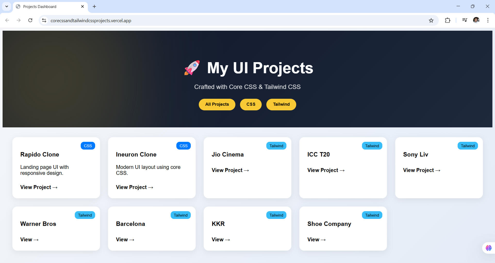

# 🚀 PROJECT DASHBOARD

🎨 A modern **Projects Dashboard** to showcase all my **CSS & Tailwind UI projects** in one place.

> Built to organize, present, and navigate through my frontend projects like a real developer portfolio.

---

## 🌐 Live Preview

👉 [View Dashboard](https://corecssandtailwindcssprojects.vercel.app/) *

---


## ✨ Features

- 📂 Organized project showcase
- 🎯 Filter projects by:
  - Core CSS
  - Tailwind CSS
- 💡 Clean & modern UI design
- 📱 Fully responsive layout
- ⚡ Smooth interactions
- 🎨 Premium UI with animations

---

## 🛠️ Tech Stack

- HTML5  
- CSS3  
- Tailwind CSS  
- JavaScript  

---

## 📁 Projects Included

### 🎨 Core CSS Projects
- 🚀 Rapido Clone
- 🎓 Ineuron Clone

### ⚡ Tailwind CSS Projects
- 🎬 Jio Cinema Clone  
- 🏏 ICC T20 Clone  
- 📺 Sony Liv Clone  
- 🎥 Warner Bros Discovery Clone  
- ⚽ Barcelona Clone  
- 🏆 KKR Clone  
- 👟 Shoe Company UI  

---

## 📸 Preview



---

## 🚀 Getting Started

Clone the repository:

```bash
git clone https://github.com/kapilsarkar/PROJECT-DASHBOARD.git
```

# 👨‍💻 Author

## Kapil Sarkar

- 💼 Frontend Developer (Learning & Building)

- 🚀 Passionate about UI/UX & Web Development

### ⭐ Show Your Support

- If you like this project:

- 👉 Give it a ⭐ on GitHub
- 👉 Share it with others

### 📌 Note

- This project is part of my journey to become a Full Stack Developer and build real-world UI projects.